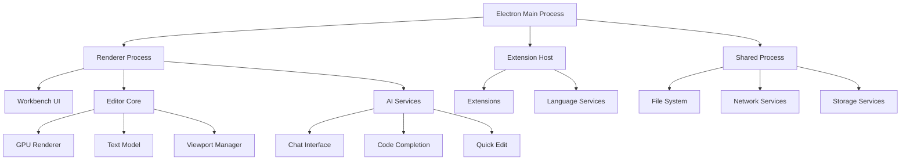

# FlowCode Program Specification

## 📋 Overview

FlowCode is an AI-powered code editor built on the VSCode codebase, designed to provide seamless AI integration, advanced performance optimizations, and a modern development experience. This specification outlines the complete program architecture, features, and implementation details.

## 🎯 Core Features

### AI Integration
- **Chat Interface**: Natural language coding assistance (Ctrl+L)
- **Quick Edit**: Inline code editing with AI suggestions (Ctrl+K)
- **Smart Apply**: Fast search/replace or full file rewrite
- **Autocomplete**: Real-time AI-powered code completion
- **Multi-Model Support**: OpenAI, Anthropic, Ollama, Groq, Mistral
- **Local Hosting**: Run models locally with Ollama
- **MCP Integration**: Model Context Protocol for tool integration

### Performance Features
- **GPU Acceleration**: WebGPU-based rendering system
- **Memory Optimization**: Advanced memory management with leak detection
- **Large File Support**: Optimized handling of files up to 1GB
- **Caching System**: Multi-level caching for optimal performance
- **Extension Management**: Lazy loading and efficient activation

## 🏗️ Architecture

### System Architecture



### Entry Points

#### 1. Desktop Application (`src/main.ts`)
```typescript
// Main Electron process entry point
import { app, protocol, crashReporter, Menu, contentTracing } from 'electron';
import { bootstrapESM } from './bootstrap-esm.js';
import { startup } from './vs/code/electron-main/main.js';

// Performance monitoring
perf.mark('code/didStartMain');
perf.mark('code/willLoadMainBundle');

// Application lifecycle
app.once('ready', async () => {
  await startup(codeCachePath, nlsConfig);
  perf.mark('code/didRunMainBundle');
});
```

#### 2. Web Application (`src/vs/workbench/browser/web.main.ts`)
```typescript
// Browser-based version entry point
export class BrowserMain extends Disposable {
  async startup(): Promise<void> {
    // Initialize workbench services
    await this.initServices();

    // Setup AI services
    await this.setupAIServices();

    // Initialize UI
    await this.createWorkbench();
  }
}
```

#### 3. Server Mode (`src/server-main.ts`)
```typescript
// Server-side rendering and API
export class ServerMain {
  async startup(): Promise<void> {
    // Initialize server services
    await this.initServerServices();

    // Setup API endpoints
    await this.setupAPI();

    // Start HTTP server
    await this.startServer();
  }
}
```

#### 4. CLI Tool (`cli/src/bin/code/main.rs`)
```rust
// Rust-based CLI implementation
#[tokio::main]
async fn main() -> Result<(), Box<dyn std::error::Error>> {
    let args = Args::parse();

    match args.command {
        Commands::Open { path } => {
            // Open file or directory
            open_path(path).await?;
        }
        Commands::Serve { port } => {
            // Start server mode
            serve(port).await?;
        }
    }

    Ok(())
}
```

## 🔧 Core Components

### 1. AI Services

#### Chat Interface (`src/vs/workbench/contrib/chat/`)
```typescript
export class ChatModel extends Disposable implements IChatModel {
  // Chat session management
  private _sessionId: string;
  private _requests: ChatRequestModel[] = [];

  // AI provider integration
  async sendRequest(message: string, options?: IChatRequestOptions): Promise<void> {
    const request = new ChatRequestModel(message, this);
    this._requests.push(request);

    // Send to AI provider
    const response = await this.aiService.sendMessage(message, options);
    request.setResponse(response);
  }
}
```

#### Quick Edit (`src/vs/workbench/contrib/quickEdit/`)
```typescript
export class QuickEditService implements IQuickEditService {
  async applyEdit(
    editor: ICodeEditor,
    selection: Range,
    instruction: string
  ): Promise<void> {
    // Get context around selection
    const context = this.getContext(editor, selection);

    // Send to AI for editing
    const edit = await this.aiService.generateEdit(context, instruction);

    // Apply edit
    await editor.executeEdits('quickEdit', [edit]);
  }
}
```

#### Code Completion (`src/vs/workbench/contrib/autocomplete/`)
```typescript
export class AICodeCompletionProvider implements CompletionItemProvider {
  async provideCompletionItems(
    document: TextDocument,
    position: Position,
    token: CancellationToken
  ): Promise<CompletionItem[]> {
    // Get context
    const context = this.getCompletionContext(document, position);

    // Generate completions
    const completions = await this.aiService.generateCompletions(context);

    return completions.map(comp => ({
      label: comp.text,
      kind: CompletionItemKind.Snippet,
      insertText: comp.text,
      detail: comp.description
    }));
  }
}
```

### 2. GPU Rendering System

#### GPU Context (`src/vs/editor/browser/gpu/viewGpuContext.ts`)
```typescript
export class ViewGpuContext extends Disposable {
  private static device: Promise<GPUDevice>;
  private static _atlas: TextureAtlas;

  constructor(
    context: ViewContext,
    @IInstantiationService private readonly _instantiationService: IInstantiationService
  ) {
    super();

    // Request GPU device
    if (!ViewGpuContext.device) {
      ViewGpuContext.device = GPULifecycle.requestDevice();
    }

    // Initialize texture atlas
    if (!ViewGpuContext._atlas) {
      ViewGpuContext._atlas = this._instantiationService.createInstance(TextureAtlas);
    }
  }
}
```

#### Render Strategies
```typescript
// Viewport-based rendering for large files
export class ViewportRenderStrategy extends BaseRenderStrategy {
  static readonly maxSupportedColumns = 200;

  update(viewportData: ViewportData, viewLineOptions: ViewLineOptions): number {
    // Pre-allocate variables for performance
    let chars = '';
    let segment: string | undefined;
    let charWidth = 0;

    // Render only visible viewport
    for (let y = viewportData.startLineNumber; y <= viewportData.endLineNumber; y++) {
      // Process line rendering
      this.renderLine(y, viewportData, viewLineOptions);
    }

    return this._visibleObjectCount;
  }
}

// Full-file rendering with caching
export class FullFileRenderStrategy extends BaseRenderStrategy {
  static readonly maxSupportedLines = 3000;
  static readonly maxSupportedColumns = 200;

  private _cellValueBuffers: [ArrayBuffer, ArrayBuffer];
  private _activeDoubleBufferIndex: 0 | 1 = 0;

  update(viewportData: ViewportData, viewLineOptions: ViewLineOptions): number {
    // Double-buffering for smooth rendering
    const cellBuffer = new Float32Array(this._cellValueBuffers[this._activeDoubleBufferIndex]);

    // Handle queued updates
    this.processQueuedUpdates();

    // Render dirty lines only
    this.renderDirtyLines(viewportData);

    return this._visibleObjectCount;
  }
}
```

### 3. Memory Management

#### Disposable Pattern (`src/vs/base/common/lifecycle.ts`)
```typescript
export class GCBasedDisposableTracker implements IDisposableTracker {
  private readonly _registry = new FinalizationRegistry<string>(heldValue => {
    console.warn(`[LEAKED DISPOSABLE] ${heldValue}`);
  });

  trackDisposable(disposable: IDisposable): void {
    const stack = new Error('CREATED via:').stack!;
    this._registry.register(disposable, stack, disposable);
  }

  markAsDisposed(disposable: IDisposable): void {
    this._registry.unregister(disposable);
  }
}
```

#### Reference Collection (`src/vs/base/common/lifecycle.ts`)
```typescript
export abstract class ReferenceCollection<T> {
  private readonly references: Map<string, { readonly object: T; counter: number }> = new Map();

  acquire(key: string, ...args: any[]): IReference<T> {
    let reference = this.references.get(key);

    if (!reference) {
      reference = { counter: 0, object: this.createReferencedObject(key, ...args) };
      this.references.set(key, reference);
    }

    reference.counter++;

    return {
      object: reference.object,
      dispose: () => {
        if (--reference.counter === 0) {
          this.destroyReferencedObject(key, reference.object);
          this.references.delete(key);
        }
      }
    };
  }
}
```

### 4. Caching System

#### LRU Cache (`src/vs/base/common/cache.ts`)
```typescript
export class LRUCache<K, V> extends Cache<K, V> {
  constructor(limit: number, ratio: number = 1) {
    super(limit, ratio);
  }

  protected override trim(newSize: number) {
    this.trimOld(newSize);
  }

  override set(key: K, value: V): this {
    super.set(key, value);
    this.checkTrim();
    return this;
  }
}
```

#### Configuration Cache (`src/vs/workbench/services/configuration/common/configurationCache.ts`)
```typescript
export class ConfigurationCache implements IConfigurationCache {
  private readonly cachedConfigurations: Map<string, CachedConfiguration> = new Map();

  read(key: ConfigurationKey): Promise<string> {
    return this.getCachedConfiguration(key).read();
  }

  write(key: ConfigurationKey, content: string): Promise<void> {
    return this.getCachedConfiguration(key).save(content);
  }

  private getCachedConfiguration({ type, key }: ConfigurationKey): CachedConfiguration {
    const k = `${type}:${key}`;
    let cachedConfiguration = this.cachedConfigurations.get(k);
    if (!cachedConfiguration) {
      cachedConfiguration = new CachedConfiguration({ type, key }, this.cacheHome, this.fileService);
      this.cachedConfigurations.set(k, cachedConfiguration);
    }
    return cachedConfiguration;
  }
}
```

### 5. Extension System

#### Extension Service (`src/vs/workbench/services/extensions/common/abstractExtensionService.ts`)
```typescript
export abstract class AbstractExtensionService extends Disposable implements IExtensionService {
  private readonly _extensionHostManagers: IExtensionHostManager[] = [];

  protected async _initialize(): Promise<void> {
    perf.mark('code/willLoadExtensions');

    // Start extension hosts
    this._startExtensionHostsIfNecessary(true, []);

    // Resolve and process extensions
    const lock = await this._registry.acquireLock('_initialize');
    try {
      await this._resolveAndProcessExtensions(lock);

      // Start non-auto-start extension hosts
      const snapshot = this._registry.getSnapshot();
      for (const extHostManager of this._extensionHostManagers) {
        if (extHostManager.startup !== ExtensionHostStartup.EagerAutoStart) {
          const extensions = this._runningLocations.filterByExtensionHostManager(snapshot.extensions, extHostManager);
          extHostManager.start(snapshot.versionId, snapshot.extensions, extensions.map(extension => extension.identifier));
        }
      }
    } finally {
      lock.dispose();
    }

    this._releaseBarrier();
    perf.mark('code/didLoadExtensions');
  }
}
```

#### Extension Host Manager (`src/vs/workbench/services/extensions/common/extensionHostManager.ts`)
```typescript
export class ExtensionHostManager extends Disposable implements IExtensionHostManager {
  private _proxy: Promise<IExtensionHostProxy | null>;
  private _hasStarted: boolean = false;

  constructor(
    extensionHost: IExtensionHost,
    initialActivationEvents: string[],
    @ITelemetryService private readonly _telemetryService: ITelemetryService
  ) {
    super();

    // Track extension host startup
    const startingTelemetryEvent: ExtensionHostStartupEvent = {
      time: Date.now(),
      action: 'starting',
      kind: extensionHostKindToString(this.kind)
    };
    this._telemetryService.publicLog2<ExtensionHostStartupEvent, ExtensionHostStartupClassification>('extensionHostStartup', startingTelemetryEvent);

    this._proxy = this._extensionHost.start().then(
      (protocol) => {
        this._hasStarted = true;

        // Track successful startup
        const successTelemetryEvent: ExtensionHostStartupEvent = {
          time: Date.now(),
          action: 'success',
          kind: extensionHostKindToString(this.kind)
        };
        this._telemetryService.publicLog2<ExtensionHostStartupEvent, ExtensionHostStartupClassification>('extensionHostStartup', successTelemetryEvent);

        return this._createExtensionHostCustomers(this.kind, protocol);
      },
      (err) => {
        // Track startup errors
        const failureTelemetryEvent: ExtensionHostStartupEvent = {
          time: Date.now(),
          action: 'error',
          kind: extensionHostKindToString(this.kind),
          errorName: err?.name,
          errorMessage: err?.message,
          errorStack: err?.stack
        };
        this._telemetryService.publicLog2<ExtensionHostStartupEvent, ExtensionHostStartupClassification>('extensionHostStartup', failureTelemetryEvent);

        return null;
      }
    );
  }
}
```

## 🔌 API Integration

### AI Provider Interface
```typescript
export interface IAiProvider {
  readonly id: string;
  readonly name: string;
  readonly capabilities: AiProviderCapabilities;

  sendMessage(message: string, options?: IAiRequestOptions): Promise<IAiResponse>;
  generateCompletions(context: string, position: Position): Promise<CompletionItem[]>;
  generateEdit(context: string, instruction: string): Promise<TextEdit[]>;
}

// OpenAI Provider
export class OpenAIProvider implements IAiProvider {
  readonly id = 'openai';
  readonly name = 'OpenAI';
  readonly capabilities = {
    chat: true,
    completions: true,
    edits: true,
    streaming: true
  };

  async sendMessage(message: string, options?: IAiRequestOptions): Promise<IAiResponse> {
    const response = await fetch('https://api.openai.com/v1/chat/completions', {
      method: 'POST',
      headers: {
        'Authorization': `Bearer ${this.apiKey}`,
        'Content-Type': 'application/json'
      },
      body: JSON.stringify({
        model: options?.model || 'gpt-4',
        messages: [{ role: 'user', content: message }],
        stream: options?.stream || false
      })
    });

    if (!response.ok) {
      throw new Error(`OpenAI API error: ${response.status} ${response.statusText}`);
    }

    return response.json();
  }
}

// Ollama Provider (Local)
export class OllamaProvider implements IAiProvider {
  readonly id = 'ollama';
  readonly name = 'Ollama';
  readonly capabilities = {
    chat: true,
    completions: true,
    edits: true,
    streaming: true,
    local: true
  };

  async sendMessage(message: string, options?: IAiRequestOptions): Promise<IAiResponse> {
    const response = await fetch(`http://localhost:11434/api/chat`, {
      method: 'POST',
      headers: {
        'Content-Type': 'application/json'
      },
      body: JSON.stringify({
        model: options?.model || 'llama2',
        messages: [{ role: 'user', content: message }],
        stream: options?.stream || false
      })
    });

    if (!response.ok) {
      throw new Error(`Ollama API error: ${response.status} ${response.statusText}`);
    }

    return response.json();
  }
}
```

### MCP (Model Context Protocol) Integration
```typescript
export class McpServerRequestHandler extends Disposable {
  private _nextRequestId = 1;
  private _pendingRequests = new Map<number, { promise: DeferredPromise<MCP.ServerResult> }>();

  private async sendRequest<T extends MCP.ClientRequest, R extends MCP.ServerResult>(
    request: Pick<T, 'params' | 'method'>,
    token: CancellationToken = CancellationToken.None
  ): Promise<R> {
    if (this._store.isDisposed) {
      return Promise.reject(new CancellationError());
    }

    const id = this._nextRequestId++;

    // Create JSON-RPC request
    const jsonRpcRequest: MCP.JSONRPCRequest = {
      jsonrpc: MCP.JSONRPC_VERSION,
      id,
      ...request
    };

    const promise = new DeferredPromise<MCP.ServerResult>();
    this._pendingRequests.set(id, { promise });

    // Set up cancellation
    const cancelListener = token.onCancellationRequested(() => {
      if (!promise.isSettled) {
        this._pendingRequests.delete(id);
        this.sendNotification({ method: 'notifications/cancelled', params: { requestId: id } });
        promise.cancel();
      }
      cancelListener.dispose();
    });

    // Send request
    this.send(jsonRpcRequest);

    return promise.p.finally(() => {
      cancelListener.dispose();
      this._pendingRequests.delete(id);
    }) as Promise<R>;
  }
}
```

## 🚀 Build System

### Gulp Configuration (`build/gulpfile.js`)
```javascript
const gulp = require('gulp');
const { transpileTask, compileTask, watchTask } = require('./lib/compilation');
const { bundleTask, minifyTask } = require('./lib/optimize');

// Compilation tasks
const compileClientTask = task.define('compile-client', task.series(
  util.rimraf('out'),
  compileApiProposalNamesTask,
  compileTask('src', 'out', false)
));

const watchClientTask = task.define('watch-client', task.series(
  util.rimraf('out'),
  task.parallel(watchTask('out', false), watchApiProposalNamesTask)
));

// Bundle tasks
const bundleVSCodeTask = task.define('bundle-vscode', task.series(
  util.rimraf('out-vscode'),
  bundleTask({
    out: 'out-vscode',
    esm: {
      src: 'out-build',
      entryPoints: clientEntryPoints,
      resources: clientResources
    }
  })
));

// Minification
const minifyVSCodeTask = task.define('minify-vscode', task.series(
  bundleVSCodeTask,
  util.rimraf('out-vscode-min'),
  minifyTask('out-vscode', 'https://main.vscode-cdn.net/sourcemaps')
));
```

### ESBuild Configuration (`build/lib/optimize.ts`)
```typescript
export function bundleESMTask(opts: IBundleESMTaskOpts): NodeJS.ReadWriteStream {
  const bundleAsync = async () => {
    const files: VinylFile[] = [];
    const tasks: Promise<void>[] = [];

    for (const entryPoint of opts.entryPoints) {
      const task = esbuild.build({
        bundle: true,
        packages: 'external',
        platform: 'neutral',
        format: 'esm',
        sourcemap: 'external',
        plugins: [contentsMapper, externalOverride],
        target: ['es2022'],
        loader: {
          '.ttf': 'file',
          '.svg': 'file',
          '.png': 'file',
          '.sh': 'file',
        },
        assetNames: 'media/[name]',
        entryPoints: [{
          in: path.join(REPO_ROOT_PATH, opts.src, `${entryPoint.name}.js`),
          out: entryPoint.name,
        }],
        outdir: path.join(REPO_ROOT_PATH, opts.src),
        write: false,
        metafile: true,
      }).then(res => {
        for (const file of res.outputFiles) {
          const fileProps = {
            contents: Buffer.from(file.contents),
            sourceMap: file.path.endsWith('.js') ?
              JSON.parse(res.outputFiles.find(f => f.path === `${file.path}.map`)?.text || '{}') : undefined,
            path: file.path,
            base: path.join(REPO_ROOT_PATH, opts.src)
          };
          files.push(new VinylFile(fileProps));
        }
      });

      tasks.push(task);
    }

    await Promise.all(tasks);
    return { files };
  };

  // Process bundles and resources
  bundleAsync().then((output) => {
    es.readArray(output.files).pipe(bundlesStream);
    gulp.src(opts.resources ?? [], { base: `${opts.src}`, allowEmpty: true }).pipe(resourcesStream);
  });

  return es.merge(bundlesStream, resourcesStream);
}
```

## 📦 Package Configuration

### Main Package (`package.json`)
```json
{
  "name": "flowcode",
  "version": "1.0.0",
  "main": "./out/main.js",
  "type": "module",
  "scripts": {
    "buildreact": "cd ./src/vs/workbench/contrib/flow/browser/react/ && node build.js",
    "watchreact": "cd ./src/vs/workbench/contrib/flow/browser/react/ && node build.js --watch",
    "compile": "node ./node_modules/gulp/bin/gulp.js compile",
    "watch": "npm-run-all -lp watch-client watch-extensions",
    "watch-client": "node --max-old-space-size=8192 ./node_modules/gulp/bin/gulp.js watch-client",
    "watch-extensions": "node --max-old-space-size=8192 ./node_modules/gulp/bin/gulp.js watch-extensions",
    "compile-build": "node ./node_modules/gulp/bin/gulp.js compile-build-with-mangling",
    "minify-vscode": "node ./node_modules/gulp/bin/gulp.js minify-vscode",
    "vercel-build": "NODE_OPTIONS='--max-old-space-size=8192' npm run buildreact && npm run compile && npm run compile-build && npm run minify-vscode"
  },
  "dependencies": {
    "@anthropic-ai/sdk": "^0.40.0",
    "@google/genai": "^0.13.0",
    "@mistralai/mistralai": "^1.6.0",
    "@modelcontextprotocol/sdk": "^1.11.2",
    "ollama": "^0.5.15",
    "openai": "^4.96.0",
    "react": "^19.1.0",
    "react-dom": "^19.1.0"
  },
  "devDependencies": {
    "electron": "34.3.2",
    "esbuild": "^0.19.0",
    "gulp": "^4.0.0",
    "typescript": "^5.8.0-dev.20250207",
    "webpack": "^5.94.0"
  }
}
```

### Product Configuration (`product.json`)
```json
{
  "nameShort": "FlowCode",
  "nameLong": "FlowCode",
  "flowcodeVersion": "1.0.0",
  "applicationName": "flowcode",
  "dataFolderName": ".flowcode",
  "licenseName": "MIT",
  "licenseUrl": "https://github.com/flowcode/flowcode/blob/main/LICENSE.txt",
  "extensionsGallery": {
    "serviceUrl": "https://marketplace.visualstudio.com/_apis/public/gallery",
    "itemUrl": "https://marketplace.visualstudio.com/items"
  },
  "linkProtectionTrustedDomains": [
    "https://flowcode.com",
    "https://flowcode.dev",
    "https://github.com/flowcode/flowcode",
    "https://ollama.com"
  ]
}
```

## 🧪 Testing Strategy

### Unit Tests
```typescript
// Performance tests
describe('Performance Tests', () => {
  test('Startup time should be under 2 seconds', async () => {
    const startTime = performance.now();
    await app.startup();
    const endTime = performance.now();

    expect(endTime - startTime).toBeLessThan(2000);
  });

  test('Memory usage should be under 500MB', () => {
    const memoryUsage = process.memoryUsage();
    expect(memoryUsage.heapUsed).toBeLessThan(500 * 1024 * 1024);
  });

  test('GPU rendering should maintain 60fps', async () => {
    const renderer = new ViewportRenderStrategy();
    const startTime = performance.now();

    for (let i = 0; i < 60; i++) {
      renderer.update(viewportData, viewLineOptions);
      await new Promise(resolve => setTimeout(resolve, 16)); // 60fps
    }

    const endTime = performance.now();
    const fps = 60000 / (endTime - startTime);
    expect(fps).toBeGreaterThan(55); // Allow some variance
  });
});
```

### Integration Tests
```typescript
// AI integration tests
describe('AI Integration Tests', () => {
  test('Chat interface should work with OpenAI', async () => {
    const chatModel = new ChatModel();
    const response = await chatModel.sendRequest('Hello, world!');

    expect(response).toBeDefined();
    expect(response.content).toContain('Hello');
  });

  test('Quick edit should apply changes', async () => {
    const editor = createMockEditor();
    const quickEdit = new QuickEditService();

    await quickEdit.applyEdit(editor, new Range(0, 0, 0, 10), 'Make this uppercase');

    expect(editor.getModel()?.getValue()).toBe('HELLO WORLD');
  });
});
```

## 📊 Performance Monitoring

### Telemetry Integration
```typescript
// Startup timing telemetry
export class StartupTimings implements IWorkbenchContribution {
  constructor(
    @ITimerService private readonly _timerService: ITimerService,
    @ITelemetryService private readonly _telemetryService: ITelemetryService
  ) {
    this._timerService.perfBaseline.then(perfBaseline => {
      this._telemetryService.publicLog2<StartupTimingsEvent, StartupTimingsClassification>('startupTimings', {
        ellapsedRequire: this._timerService.startupMetrics.timers.ellapsedRequire,
        ellapsedExtensions: this._timerService.startupMetrics.timers.ellapsedExtensions,
        ellapsedExtensionsReady: this._timerService.startupMetrics.timers.ellapsedExtensionsReady,
        ellapsedViewletRestore: this._timerService.startupMetrics.timers.ellapsedViewletRestore,
        ellapsedEditorRestore: this._timerService.startupMetrics.timers.ellapsedEditorRestore,
        ellapsedWorkbench: this._timerService.startupMetrics.timers.ellapsedWorkbench,
        ellapsedTimersToTimersComputed: this._timerService.startupMetrics.timers.ellapsedTimersToTimersComputed,
        perfBaseline: perfBaseline
      });
    });
  }
}
```

### Performance Profiling
```typescript
// Renderer profiling
export class RendererProfiling {
  private _observer?: PerformanceObserver;

  constructor(
    @INativeWorkbenchEnvironmentService private readonly _environmentService: INativeWorkbenchEnvironmentService,
    @ITimerService timerService: ITimerService
  ) {
    timerService.perfBaseline.then(perfBaseline => {
      const slowThreshold = perfBaseline * 10; // ~10 frames at 64fps

      const obs = new PerformanceObserver(async list => {
        const maxDuration = list.getEntries()
          .map(e => e.duration)
          .reduce((p, c) => Math.max(p, c), 0);

        if (maxDuration < slowThreshold) {
          return;
        }

        // Start profiling session
        const sessionId = generateUuid();
        this._logService.warn(`[perf] Renderer reported VERY LONG TASK (${maxDuration}ms), starting profiling session '${sessionId}'`);

        // Profile for 5 seconds
        const profile = await this.nativeHostService.profileRenderer(sessionId, 5000);
        const output = await this.profileAnalysisService.analyseBottomUp(profile, _url => '<<renderer>>', perfBaseline, true);

        if (output === ProfilingOutput.Interesting) {
          this._store(profile, sessionId);
        }
      });

      obs.observe({ entryTypes: ['longtask'] });
      this._observer = obs;
    });
  }
}
```

## 🔒 Security Considerations

### Content Security Policy
```typescript
// CSP configuration for web version
const cspDirectives = [
  "default-src 'self'",
  "script-src 'self' 'unsafe-inline' 'unsafe-eval'",
  "style-src 'self' 'unsafe-inline'",
  "img-src 'self' data: https:",
  "font-src 'self' data:",
  "connect-src 'self' https://api.openai.com https://api.anthropic.com http://localhost:11434",
  "worker-src 'self' blob:",
  "child-src 'self' blob:"
];
```

### API Key Management
```typescript
// Secure API key storage
export class ApiKeyManager {
  private readonly _storageKey = 'flowcode.apiKeys';

  async storeApiKey(provider: string, apiKey: string): Promise<void> {
    // Encrypt API key before storage
    const encryptedKey = await this.encrypt(apiKey);
    await this.storageService.store(this._storageKey, {
      [provider]: encryptedKey
    }, StorageScope.APPLICATION);
  }

  async getApiKey(provider: string): Promise<string | undefined> {
    const stored = await this.storageService.get(this._storageKey, StorageScope.APPLICATION);
    if (stored?.[provider]) {
      return await this.decrypt(stored[provider]);
    }
    return undefined;
  }

  private async encrypt(data: string): Promise<string> {
    // Use Web Crypto API for encryption
    const key = await crypto.subtle.generateKey(
      { name: 'AES-GCM', length: 256 },
      false,
      ['encrypt', 'decrypt']
    );

    const iv = crypto.getRandomValues(new Uint8Array(12));
    const encrypted = await crypto.subtle.encrypt(
      { name: 'AES-GCM', iv },
      key,
      new TextEncoder().encode(data)
    );

    return JSON.stringify({
      key: await crypto.subtle.exportKey('raw', key),
      iv: Array.from(iv),
      data: Array.from(new Uint8Array(encrypted))
    });
  }
}
```

## 🚀 Deployment

### Vercel Configuration (`vercel.json`)
```json
{
  "version": 2,
  "name": "flowcode",
  "builds": [
    {
      "src": "package.json",
      "use": "@vercel/static-build",
      "config": {
        "distDir": "out"
      }
    }
  ],
  "buildCommand": "npm run buildreact && NODE_OPTIONS='--max-old-space-size=8192' npm run compile && npm run compile-build && npm run minify-vscode",
  "outputDirectory": "out",
  "installCommand": "npm install",
  "env": {
    "NODE_OPTIONS": "--max-old-space-size=8192"
  }
}
```

### Docker Configuration
```dockerfile
# Multi-stage build for production
FROM node:20-alpine AS builder

WORKDIR /app
COPY package*.json ./
RUN npm ci --only=production

COPY . .
RUN npm run compile && npm run compile-build && npm run minify-vscode

FROM node:20-alpine AS runtime

WORKDIR /app
COPY --from=builder /app/out ./out
COPY --from=builder /app/package.json ./

EXPOSE 3000
CMD ["node", "out/main.js"]
```

## 📈 Future Enhancements

### Planned Features
1. **WebAssembly Integration**: Move heavy computations to WASM
2. **Service Worker Caching**: Offline capability and background sync
3. **Advanced AI Features**: Code generation, refactoring, debugging assistance
4. **Collaborative Editing**: Real-time collaboration features
5. **Plugin System**: Third-party extension marketplace

### Performance Improvements
1. **Virtual Scrolling**: Handle files with millions of lines
2. **Incremental Parsing**: Parse only changed portions of files
3. **Predictive Loading**: Pre-load likely-to-be-needed resources
4. **Memory Pooling**: Reuse objects to reduce GC pressure
5. **Web Workers**: Move heavy operations off main thread

---

This specification provides a comprehensive overview of FlowCode's architecture, implementation details, and future roadmap. The system is designed for high performance, extensibility, and user experience, with a focus on AI integration and modern web technologies.
